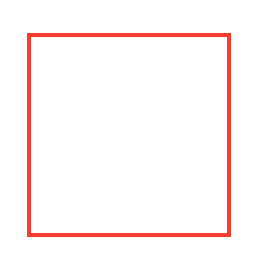
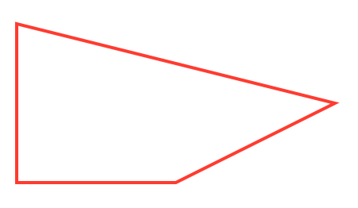

# Chris's SwiftUI Path Element Replace

Given a Shape, Replace any Element with another Element, or set of Elements

## Overview

```
import PathElementReplace

struct ExampleSwiftUIView {}

extension ExampleSwiftUIView: View {
  
  var body: some View {
    content
  }
  
  var content: some View {
    Rectangle()
      .replace(size: CGRect(origin: .zero, size: CGSize(width: 100, height: 100))) { index, element in
        if index == 1 {
          return Path.Element.line(to: CGPoint(x: 200, y: 50))
        } else {
          return nil
        }
      }
      .stroke(Color.red, lineWidth: 2)
      .frame(width: 100, height: 100)
  }
}

```

| Before | After |
|--------|-------|
|


## Documentation

Documentation website here: https://nthstate.github.io/PathElementReplace/documentation/pathelementreplace/

Building the docs

```
swift build
```

```
PACKAGE_NAME=PathElementReplace
REPOSITORY_NAME=PathElementReplace
OUTPUT_PATH=./docs

swift package --allow-writing-to-directory $OUTPUT_PATH \
    generate-documentation --target $PACKAGE_NAME \
    --disable-indexing \
    --transform-for-static-hosting \
    --hosting-base-path $REPOSITORY_NAME \
    --output-path $OUTPUT_PATH
 ```
